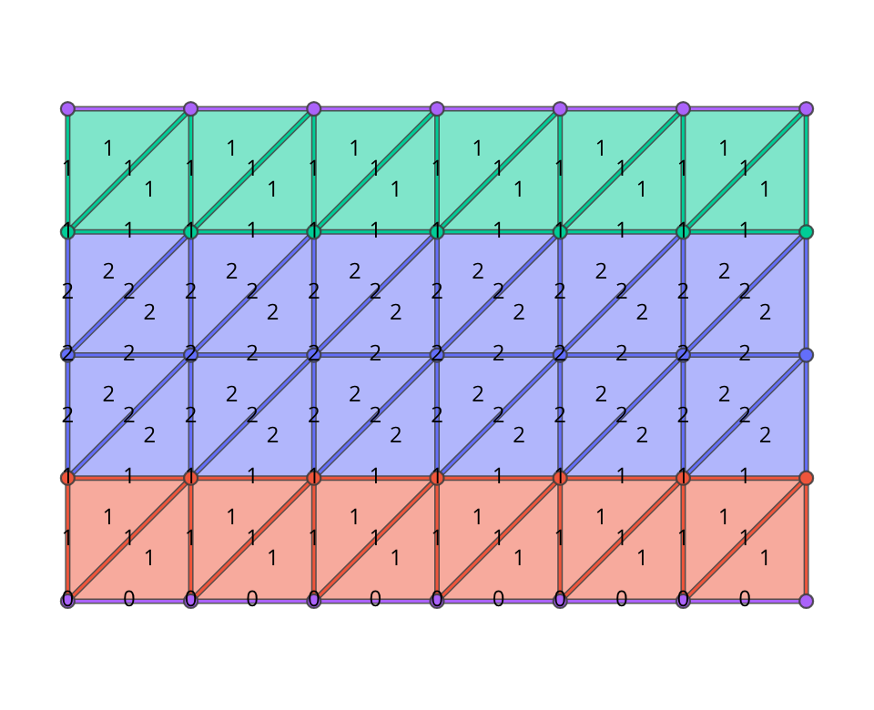
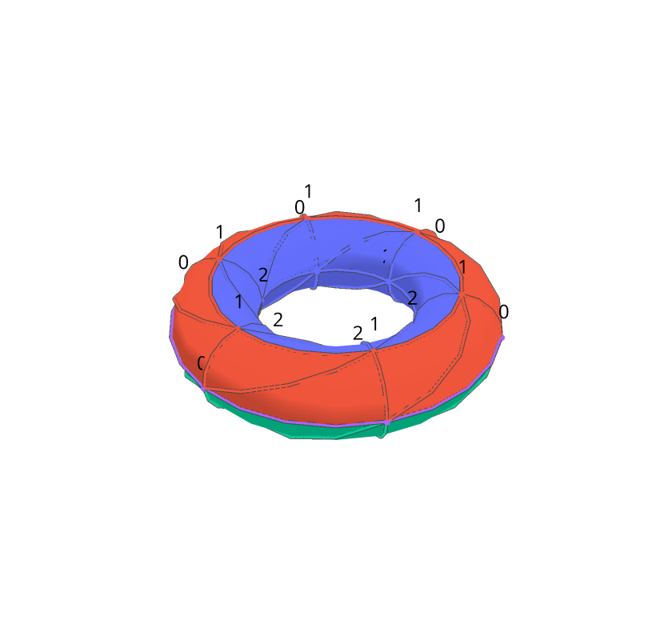
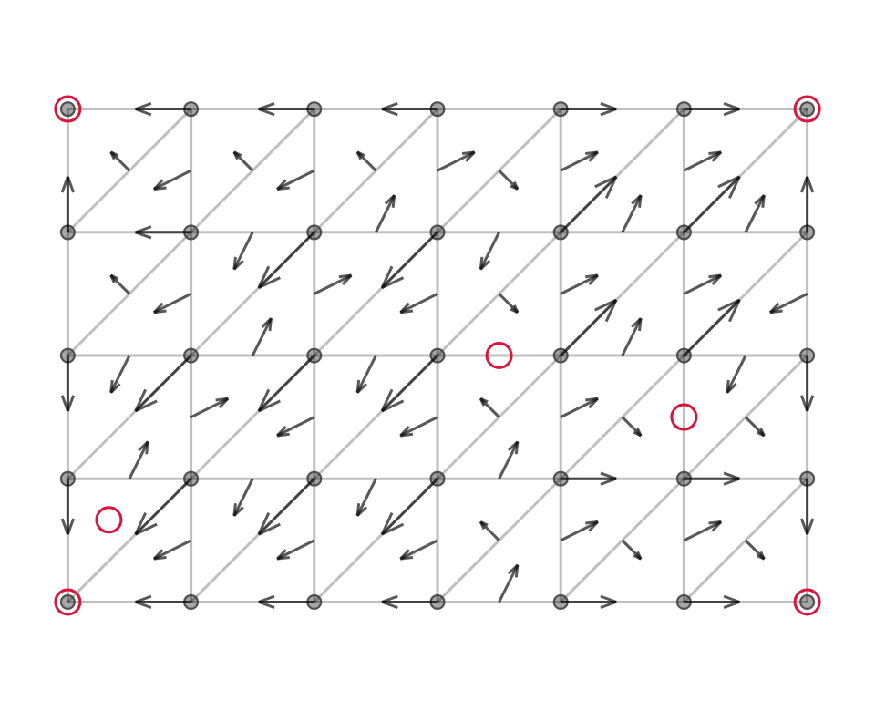
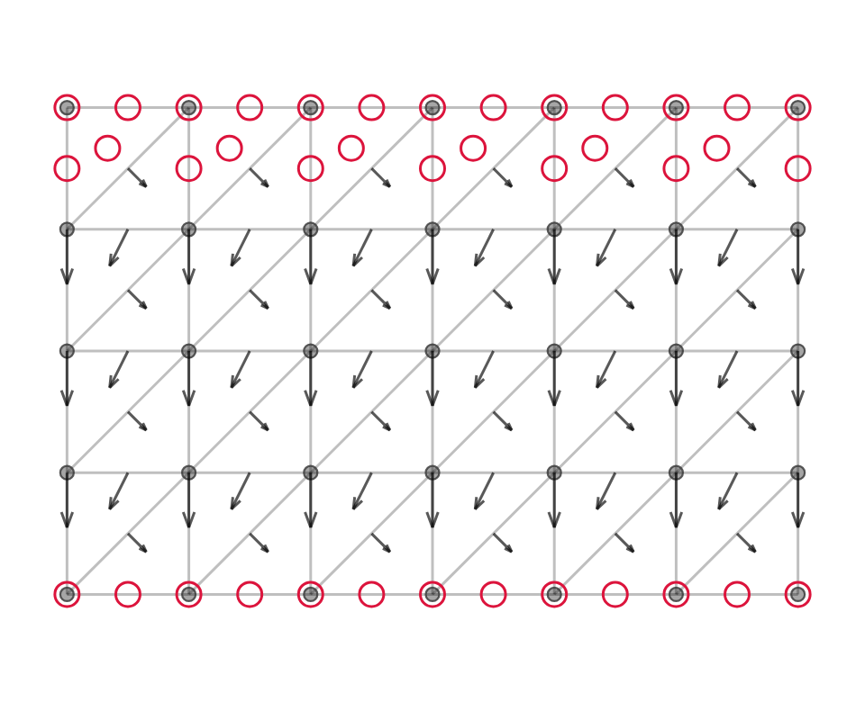

# dmb — 離散モースボット理論の計算

[](https://github.com/yokoyama-lab/dmb/actions/workflows/ci.yml)
[](https://yokoyama-lab.github.io/dmb/)

**図はブラウザで見られます → https://yokoyama-lab.github.io/dmb/**（回転・ズームができます）

有限複体（単体的複体・正則とは限らない CW 複体）の上の**離散モースボット関数**
(discrete Morse-Bott function) を計算し，図示します。定義と定理は

> Y. Nishikawa and T. Yokoyama, *On discrete Morse-Bott theory*,
> [arXiv:2511.07864](https://arxiv.org/abs/2511.07864) v2

に従います。離散モース関数 (discrete Morse function) を図示していた `dmf.py` の計算を
書き換えたもので，離散モース理論は**特別な場合として復元されます**（同 Theorem 3.2）。

| collection の色分け（トーラスの高さ関数） | 3 次元表示 |
|---|---|
|  |  |

| 臨界セル 4 個の離散モース関数（非対称） | 回転対称な離散モース関数（臨界セル 4·n 個） |
|---|---|
|  |  |

矢印は strictly noncritical pair（離散モース関数のときは Forman の V-path），
赤丸は weakly critical なセル（＝ reduced collection に入るセル）です。

これらの図を関数ごとに並べたものが [GitHub Pages](https://yokoyama-lab.github.io/dmb/) にあります（[計算結果](https://yokoyama-lab.github.io/dmb/results.html) も同じ場所）。

## インストール

理論の計算は**外部依存なし**で，Python 3.9 以降ならそのまま動きます。
可視化 (`dmb.py`) だけ dash・numpy・plotly が要ります。

```bash
git clone https://github.com/yokoyama-lab/dmb
cd dmb
pip install -r requirements.txt      # 可視化を動かす場合のみ
                                     # （pip install -e ".[app]" でも可）
```

## 使い方

```bash
python3 examples.py                  # 例集（小さい例 → DMBT ならではの強み）
python3 examples.py tutorial         # 手で確かめられる小さい例だけ
python3 examples.py strength         # 離散モース理論にはできないことだけ

python3 dmb_core.py                  # T(4,4) 上の 7 種類の関数の報告
python3 dmb_core.py 5 4              # ni=5, nj=4 のトーラスで
python3 dmb_core.py --table          # 対称性を課したときの DMT と DMBT の差の表
python3 dmb_core.py --field 2        # F_2 係数で（ねじれが見える）
python3 dmb_core.py --json           # 機械可読な出力
python3 dmb_core.py --complex my.json --json     # 自分の複体を読む

python3 complexes.py                 # 検査用の複体一覧とベッチ数
python3 search.py --ni 4 --nj 3 --values 2       # 不変な DMBF の全数探索
python3 export.py --format tikz -o fig.tex       # 論文に貼れる TikZ 図
python3 dmb.py                       # 可視化 http://127.0.0.1:8050/
python3 dmf.py                       # もとの離散モース関数の図（変更していない）
```

ライブラリとしても使えます。

```python
import dmb_core as D

K = D.torus(5, 4)                    # トーラスの三角形分割
f = D.height_fn(K, 5, 4)             # 回転対称な離散モースボット関数
M = D.MorseBott(K, f)
M.is_dmb()                           # → True   (M1)(MB2)(M3)(MB4) を満たすか
M.collections()                      # → 値が等しく r-path で繋がるセルの同値類
M.reduced_collections()              # → その weakly critical な部分
M.report()["R_MB"]                   # → []  すなわち R(t) = 0（等号）

D.homology_z(K.cells)                # 整数係数ホモロジー（ねじれ込み）
D.MorseBott(K, f, p=2).report()      # F_2 係数で
```

自分の複体は `D.Complex([...])`（facet を渡す）か，正則とは限らない CW 複体なら
`D.CWComplex(...)`。JSON からも読めます（`complexes.load_json`）。

```python
K = D.Complex([(0, 1, 2), (0, 1, 3), (0, 2, 3), (1, 2, 3)])   # S^2 = ∂Δ^3
K = D.cw_projective_plane_minimal()                            # RP^2（3 セル）
```

### 可視化 (`dmb.py`) の操作

- **Function**: 表示する関数（高さ関数・細分版・定数関数・Morsification・
  臨界セル 4 個の DMF・回転対称な DMF・`dmf.py` の calcDMF）。
- **Grid Size (i, θ 方向) / (j, φ 方向)**: トーラス T(ni, nj) の分割数（各 3〜16）。
  j が高さ関数の準位の数，i が回転対称性 Z_ni の位数です。
- **Smooth**: 3D 表示の三角形の細分数。
- **Cell Name / Value f / Collection / No Label**: ラベルの切り替え。
  Cell Name は `dmf.py` と同じ `v_k` / `e_k` / `f_k` です。
- **Show Color (値)** / **Show Collection (色分け)** / **Show Arrow (snc pair)** /
  **Show Weakly Critical**: 表示の切り替え。
- 図の下に Theorem 4.12 の検算（P_t(K), Σ_C P_t(C), R(t)）が出ます。

分割数の上限は `dmb.py` の `MAX_GRID`，ポートは末尾の `run(port=8050)` で変えられます。

### 静的サイトの書き出し (`pages.py`)

`dmb.py` は Dash（Flask サーバ）なので GitHub Pages には置けません。同じ図を
plotly の自己完結 HTML としてあらかじめ書き出し，索引を付けて並べるのが `pages.py` です。

```
pip install -e ".[app,pages]"
python3 pages.py -o _site        # _site/index.html ができる
python3 -m http.server -d _site  # 手元で確認 → http://localhost:8000/
```

回転・ズーム・ホバーはブラウザ側で効きますが，関数や分割数の切り替えはできません
（切り替えたいときは手元で `dmb.py` を動かします）。並べる図は `pages.py` の `FIGURES`，
配備は `.github/workflows/pages.yml`（main への push で https://yokoyama-lab.github.io/dmb/ に出ます）。

## ディレクトリ構成

```
dmb_core.py        理論の計算（単体的複体・CW 複体・DMB/DMF の判定・collection・
                   ホモロジー・Theorem 4.12 の検算・Morsification・描画座標）依存なし
complexes.py       検査用の複体（S^1, S^2, 円板, メビウス, RP^2, クラインの壺, …）と
                   JSON 入出力                                             依存なし
examples.py        例集（理解のための小さい例と DMBT ならではの強み）           依存なし
search.py          Z_ni 不変な離散モースボット関数の全数探索                    依存なし
export.py          図の書き出し（TikZ は依存なし。HTML/PNG/SVG は plotly）
dmb.py             Dash による可視化                                   dash/numpy/plotly
pages.py           GitHub Pages 用の静的サイトの書き出し          dash/numpy/plotly/markdown
dmf.py             もとの離散モース関数の図示（変更していない）              dash/numpy/plotly
tests/             検査（177 件。dash が無ければ可視化のぶんは skip）
docs/results.md    計算結果と証明（層 A: 機械確認 / 層 B: 紙の証明）
docs/img/          README の図
```

## 定義（実装しているもの）

k 次元セル σ に対し

- U(σ)     = #{τ : σ ≺ τ, dim τ = k+1, f(σ) ≥ f(τ)}
- D(σ)     = #{ν : ν ≺ σ, dim ν = k−1, f(ν) ≥ f(σ)}
- U^snc(σ) = #{τ : σ ≺ τ, dim τ = k+1, f(σ) > f(τ)}
- D^snc(σ) = #{ν : ν ≺ σ, dim ν = k−1, f(ν) > f(σ)}

とおくと，

- **離散モース関数** (Definition 12): (M1) (M2) U(σ) ≤ 1 (M3) (M4) D(σ) ≤ 1
- **離散モースボット関数** (Definition 18): (M1) (MB2) U^snc(σ) ≤ 1 (M3) (MB4) D^snc(σ) ≤ 1

(M2)/(MB2) の違いは「値が等しい隣接セルを数えるかどうか」だけで，そこから
collection が生まれます。(M1)(M3) は **irregular な face（任意余次元）では値が真に
増える**という条件で，単体的複体ではすべての face が regular なので自動的に成り立ちます。
正則でない CW 複体では実質的に効き，「余次元 1 だけ」と読むと論文 v1 Lemma 3.1 の
反例が出ます（`python3 examples.py tutorial` の例 6）。

- **collection**: 値が等しく r-path で繋がるセルの同値類（滑らかな理論の臨界部分多様体の離散版）
- **weakly critical**: U^snc(σ) = D^snc(σ) = 0
- **reduced collection** C: collection の weakly critical なセル全体
- **Theorem 4.12**: Σ_C P_t(C) = P_t(K) + (1+t) R(t)，R(t) ≥ 0。
  P_t(C) は境界作用素を C に制限した複体 (C_*(C), ∂^C) のポアンカレ多項式。

## 計算結果

`python3 examples.py strength` が出す 4 つの強み（詳細と証明は [`docs/results.md`](docs/results.md)）。

**1. ねじれのある空間では，離散モース不等式は決して等号にならない。**
閉曲面は H₂(K; Z/2) ≠ 0 なのでどんな離散モース関数でも m₂ ≥ 1 ですが，
RP² とクラインの壺は有理数係数で b₂ = 0。よって R(t) ≠ 0 が常に成り立ちます
（RP² は最小 CW 構造の 3 セルでも同じ）。離散モースボット関数なら R(t) = 0 に
できます。**この差は係数体に依り**，ねじれが見える F₂ 上では同じ離散モース関数が
鋭くなります。離散モースボット関数はどの係数体でも鋭くできます。

| 複体 | 係数 | P_t(K) | 最小の DMF の M(t) | R_DMF | R_DMBF |
|---|---|---|---|---|---|
| RP² | Q | 1 | 1+t+t² | t | 0 |
| RP² | F₂ | 1+t+t² | 1+t+t² | 0 | 0 |
| クラインの壺 | Q | 1+t | 1+2t+t² | t | 0 |
| クラインの壺 | F₂ | 1+2t+t² | 1+2t+t² | 0 | 0 |

**2. 対称性を課すと離散モース理論は悪化するが，離散モースボット理論は悪化しない。**
トーラス T(ni, nj) の θ 方向の回転 Z_ni（セルに自由に作用）について:

| 関数 | 対称 | 臨界セル / 臨界円周 | Σ_C P_t(C) | R(t) |
|---|---|---|---|---|
| 臨界セル 4 個の DMF（tree-cotree） | いいえ | 4 セル | 1+2t+t² | 0 |
| Z_ni 不変な DMF（最小） | はい | 4·ni セル | ni(1+2t+t²) | (ni−1)(1+t) |
| Z_ni 不変な離散モースボット高さ関数 | はい | 臨界円周 2 本 | 1+2t+t² | **0** |

さらに全数探索（`search.py`）により，T(3,3)・T(4,3)・T(3,4)・T(4,4) で値 2 通りの
範囲では **鋭い不変 DMBF は 2 種類しかない**ことが分かります: 「(1+t) と t(1+t) の
2 本の臨界円周」（滑らかな Morse-Bott 関数と同じ形）と，collection 1 つが
P_t(T²) を丸ごと担う自明な形だけです。たとえば T(4,4) では 121842 個の不変 DMBF の
うち 4410 個が鋭く，その内訳は前者 4408 個・後者 2 個でした。

**4. ねじれと対称性は独立に効く（クラインの壺）。**
回転で不変な三角形分割のクラインの壺（`klein_bottle_sym`）では，平行移動 g の位数は
2·ni で，**ni が奇数のときに限り** g² の生成する Z_ni が自由に作用します。このとき
不変な離散モース関数は 2 つの障害を同時に受けます:

| 係数 | 非対称な最小 DMF | Z_ni 不変な DMF（下限） | 不変な DMBF |
|---|---|---|---|
| Q | t | ≥ (ni−1)(1+t) + t | 0 |
| F₂ | 0 | ≥ (ni−1)(1+t) | 0 |

差はちょうど t（ねじれのぶん）で，係数体を F₂ にするとそこだけ消えます。
離散モースボット関数はどちらでも R = 0 です。

**3. 滑らかな Morse-Bott 関数を再現する。**
回転対称なトーラスの「軸からの距離」は指数 0・1 の臨界円周を持ち
Σ_i t^λi P_t(S¹) = (1+t) + t(1+t) = 1 + 2t + t² = P_t(T²) となりますが，
離散版でも 2 つの reduced collection が P_t = 1+t と t+t² を与えます。

## 検査

```bash
python3 -m unittest discover -s tests -t . -v          # 177 件
DMB_TRIALS=60 python3 -m unittest tests.test_properties   # 乱択の試行を増やす
DMB_SLOW=1    python3 -m unittest tests.test_search       # 総当たりとの突き合わせ
DMB_LATEX=1   python3 -m unittest tests.test_export       # TikZ を実際に組む
DMB_RENDER=1  python3 -m unittest tests.test_dmb_app      # 図を画像に書き出す
ruff check .
```

内訳:

- `tests/test_dmb_core.py` — トーラス上の定理の再現と，変異注入による負の対照
- `tests/test_complexes.py` — トーラス以外の複体でのホモロジーと理論
- `tests/test_cw.py` — 正則でない CW 複体，(M1)(M3)，論文 v1 Lemma 3.1 の反例
- `tests/test_homology.py` — Smith 標準形・ねじれ・係数体を変えたときの鋭さ
- `tests/test_properties.py` — 乱択の property-based test（collection の分割・極大性，
  値の狭義単調な取り替えと頂点の付け替えでの不変性，Theorem 3.2 の両方向，
  Theorem 4.12，Morsification，Forman の U+D ≤ 1，強いモース不等式）
- `tests/test_search.py` — 全数探索（枝刈りの健全性，総当たりとの一致）
- `tests/test_export.py` — TikZ 出力（LaTeX で実際に組めること）
- `tests/test_cli.py` — コマンドラインと JSON 入出力
- `tests/test_dmb_app.py` — 可視化（全操作の組合せ，図形の座標，画像出力）
- `tests/test_examples.py` — 実行可能な台本と，強みの主張そのもの

**検出力も測っています**（変異注入）。辺 1 本の値を下げると (MB4) が破れることを全 48 本で確認，
接続係数の符号を落とすとベッチ数が変わること（向きを本当に使っている）など。
速い実装（疎な消去）は素朴な実装（`rank_dense`）との突き合わせで検査しています。

## 制限

- **ホモロジーは体の上でのみ Theorem 4.12 を検算します。** 整数係数ホモロジー
  （`homology_z`，Smith 標準形）はねじれまで出しますが，Σ_C P_t(C) の計算は
  係数体（Q または F_p）上です。
- **CW 複体の接続係数は自分で与える必要があります**（`CWComplex(..., incidence=...)`）。
  ∂∘∂ = 0 になっているかは `check_boundary()` で確かめられます。
- 可視化とトーラス関係の道具（`height_fn`・`invariant_dmf`・`export.py`・`search.py`）は
  トーラス専用です。理論の計算 (`MorseBott`) は任意の複体で動きます。
- 可視化の分割数は 3〜16（`MAX_GRID`）。T(16,16)（1536 セル）で報告の計算は 0.5 秒程度です。

## 引用

このコードを使った場合は，理論の出典として次を引用してください。

```bibtex
@misc{nishikawa2025discrete,
  title  = {On discrete Morse--Bott theory},
  author = {Nishikawa, Y. and Yokoyama, T.},
  year   = {2025},
  eprint = {2511.07864},
  archivePrefix = {arXiv},
  primaryClass  = {math.GT},
  url    = {https://arxiv.org/abs/2511.07864}
}
```

英語版の README は [README.en.md](README.en.md) にあります。

## ライセンス

MIT License（[LICENSE](LICENSE)）。
